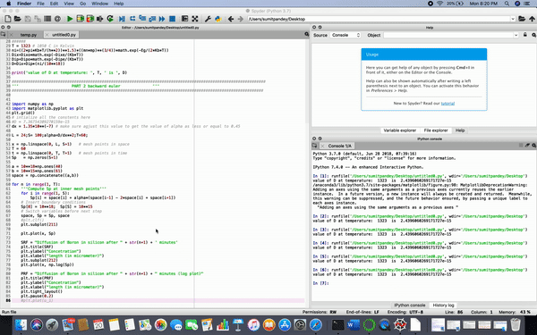
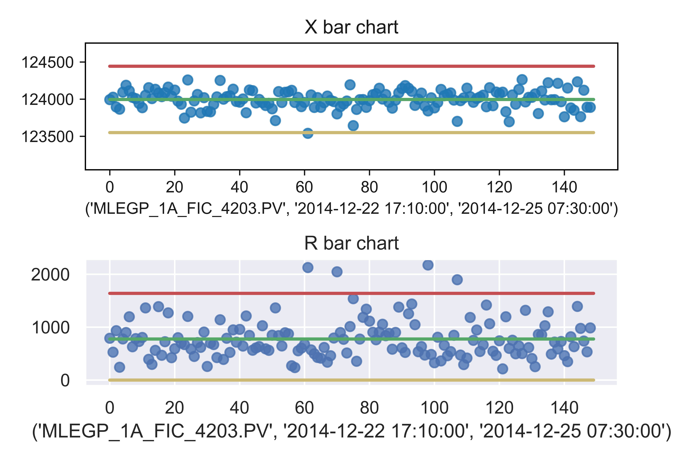
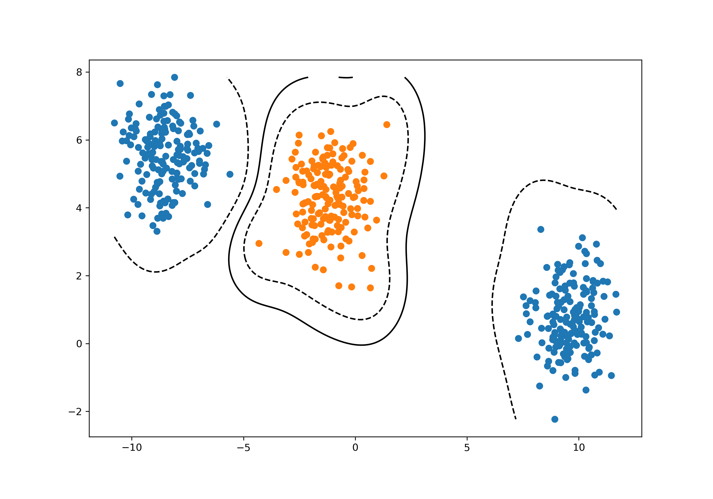
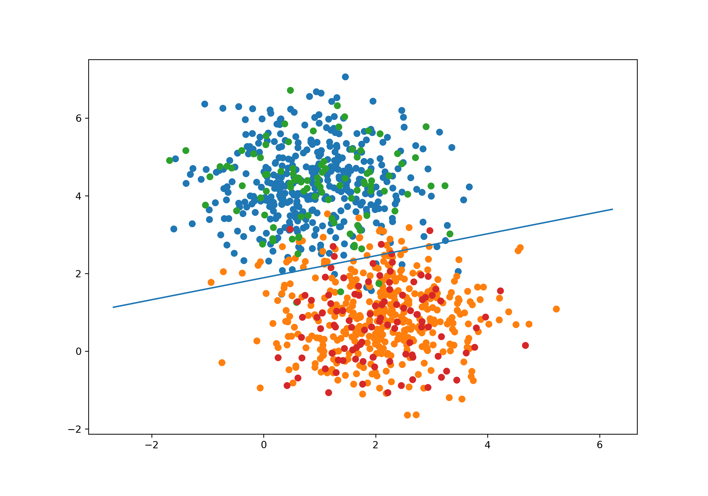
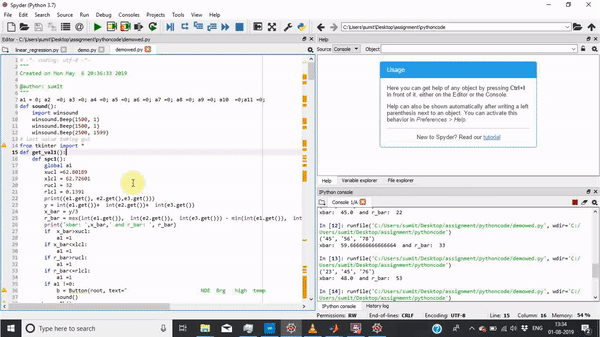

#### Hi I am Sumit, I am a curious yet organized person and get motivated from my achievements. I often keep myself occupied reading articles and intend to tackle a challenge that can benefit humanity on a mass scale. Here is the short description of my repositories. I have devided the types of my repositories into three parts:
- **Projects.** 
- **Research Papers.** 
- **Readings.**

-----------------------------

## Projects
My projects repositories are: 
### 1. Device simulation:
This repository contains python simulation code for diffusion of Boron in Silicon wafer. This was my class porject please click **[here](http://sumit-ai.me/device-simulation/)** 

   

### 2. SPC Chart:
This repository contains python code for SPC chart, this code can be found **[here](http://sumit-ai.me/SPC-chart-/)** 

 

### 3. Stanford's Machine Learning Course Projects:
This repository contains my MATLAB's code of Coursera's Machine Learning by Stanford University. This repository also contains my kaggle practice codes. Please find the repository **[here](https://github.com/Sumit-ai/Deep-Learning-)** 

  

### 4. MIT deep learing projects: 
This repository contains MIT class projects that i completed while i was taking online classes in Deep Learning from MIT at EDX. Please find the repository **[here](https://github.com/Sumit-ai/MIT-course-solutions)** 

  

### 5. Formosa predictive maintenance project: 
This repository contains the demo software that I am currently developing for Formosa Group in Center for Reliability Sciences and Technologies (CReST-CGU), Taiwan. Please find the demonstration software here. **[here](https://github.com/Sumit-ai/demo-software)** 

  

### 6. Deep Learning Specialization projects from DeepLearning.ai: 
This repository contains course projects that i am currently taking from DeepLearning.ai. Please find the repository **[here](https://github.com/Sumit-ai/deep-learning-ai-)**  

 

-----------------------------

## Research Papers
- **Pulse Oximeter for Low SpO2 Level Detection Using Discrete Time Signal Processing Algorithm:** This repository contains my oximeter research paper, information of the paper can be found **[here](https://github.com/Sumit-ai/Oximeter-paper-/tree/master)** 
- **Optimal maintenance strategy on medical instruments used for haemodialysis process:** The  information of the paper can be found **[here](http://ein.org.pl/2019-02-17)** 
- **Automatic Fire Initiated Braking And Alert System For Trains:** This paper demonstrates the technology that can save many lives, when a running train catches fire. The paper can be found **[here](https://ieeexplore.ieee.org/abstract/document/7306741)** 
- **An Intelligent Terrain Profiling Embedded System for Underwater Applications:** This paper demonstrates the technology that can create the . The paper can be found **[here](https://ieeexplore.ieee.org/document/8480329)** 

-----------------------------

## Readings
### Research papers:
- **NRI and IDI research papers:**
1. [Statistical methods for assessment of added usefulness of new biomarkers](https://www.ncbi.nlm.nih.gov/pmc/articles/PMC3155999/)
2. [Net Reclassification Index and Integrated Discrimination Index Are Not Appropriate for Testing Whether a Biomarker Improves Predictive Performance](https://www.ncbi.nlm.nih.gov/pmc/articles/PMC5837334/)
3. [The Net Reclassification Index (NRI): a Misleading Measure of Prediction Improvement Even with Independent Test Data Sets](https://www.ncbi.nlm.nih.gov/pmc/articles/PMC4615606/)
4. [Cardiologist-level arrhythmia detection and classification in ambulatory electrocardiograms using a deep neural network](https://www.nature.com/articles/s41591-018-0268-3?fbclid=IwAR25OxADckLguuc9a71Kodi9Aj6T13UR-KJkvUkSsvUcmIiAmoaHWO_Hs58)

### Books
I am following these books:
- **[Deep Learning by Ian Goodfellow and Yoshua Bengio and Aaron Courville](https://www.deeplearningbook.org)**
- **[Deep Learning with python by François Chollet](http://faculty.neu.edu.cn/yury/AAI/Textbook/Deep%20Learning%20with%20Python.pdf)**
- **[Interpretable Machine Learning: A Guide for Making Black Box Models Explainable. by Christoph Molnar](https://christophm.github.io/interpretable-ml-book/?fbclid=IwAR1XwG2egLelLlbJHdIlKFXZ44ujb2ODU6X1wzJ_tY543ZC9k-rAuhl0XKo)**
- **[Computer Age StatistiCal inference algorithms, evidence, and data science](https://web.stanford.edu/~hastie/CASI_files/PDF/casi.pdf?fbclid=IwAR3x1vSx1Kqed8m6Bnvoo5tfK5eJgrSiBwGAiPoh2RLYtMgDuCVqSiSUbu4)**

### Courses:
- **[Hinton's Course Lectures](https://www.cs.toronto.edu/~hinton/coursera_lectures.html?fbclid=IwAR1hDa1xHTljNKzsLDjpFJ8F20dWCQKwdoj-21FiIKZ1Nnncn-SzbK-EU44)**
- **[Andrew Ng's Course Lectures](https://www.coursera.org/learn/machine-learning)**

### Other Readings
- **[Deep Learning Tips and Tricks cheatsheet](https://stanford.edu/~shervine/teaching/cs-230/cheatsheet-deep-learning-tips-and-tricks?fbclid=IwAR3ESofdMy5PTF7bnxY3KWlfKYnL5mUW4Pjn9uJplseqe7delGytN1xcPas)**
- **[Recurrent Neural Networks cheatsheet](https://stanford.edu/~shervine/teaching/cs-230/cheatsheet-recurrent-neural-networks?fbclid=IwAR0XjV49cAs0MdX-kz_iR4nxHFZMXDe9eSzq6muFJdL5jesHKSAcu0Fssc8)**
- **[Convolutional Neural Networks cheatsheet](https://stanford.edu/~shervine/teaching/cs-230/cheatsheet-convolutional-neural-networks?fbclid=IwAR3qCAYfcCOxyOcR6cxAAuJBk5Wj6Dw-WUzFelI2GxSLIDWkE2XUHo2GSkE)**

### Other's Resources 
- **[ML Resources](https://sgfin.github.io/learning-resources/?fbclid=IwAR0umPazGbijWj4PsY8AM_QtDdd-Ku-xFsrAscSxMxHgvgRHInrhoCE26lU)**

